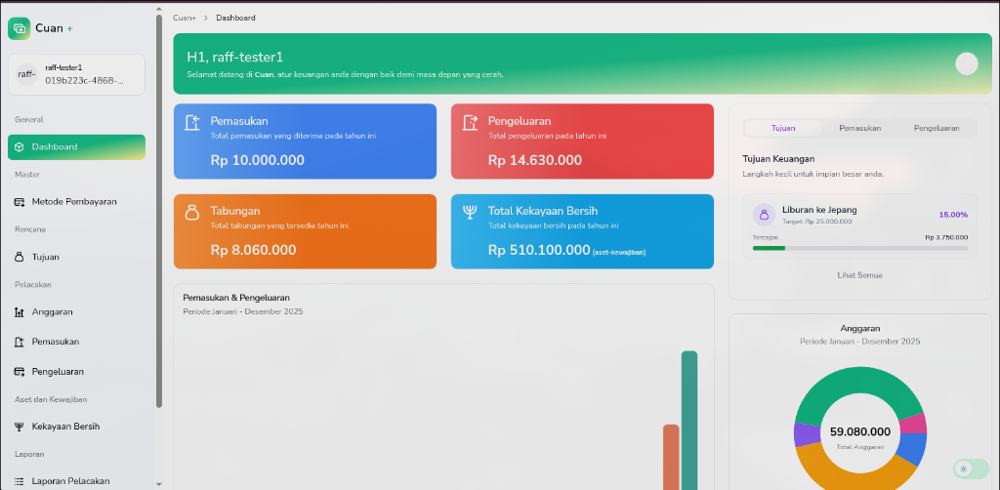
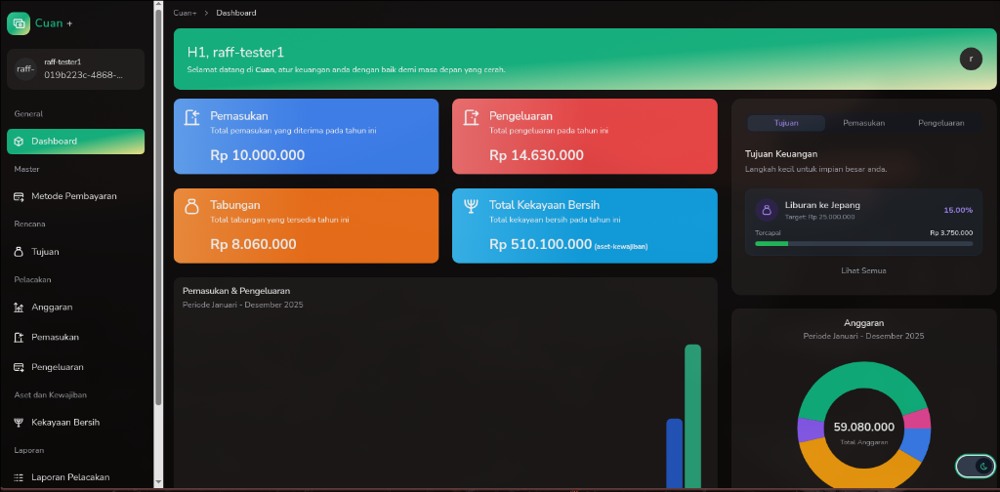
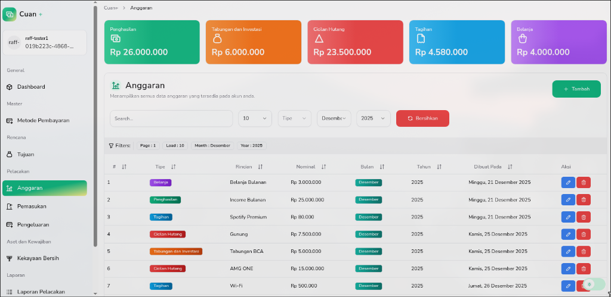
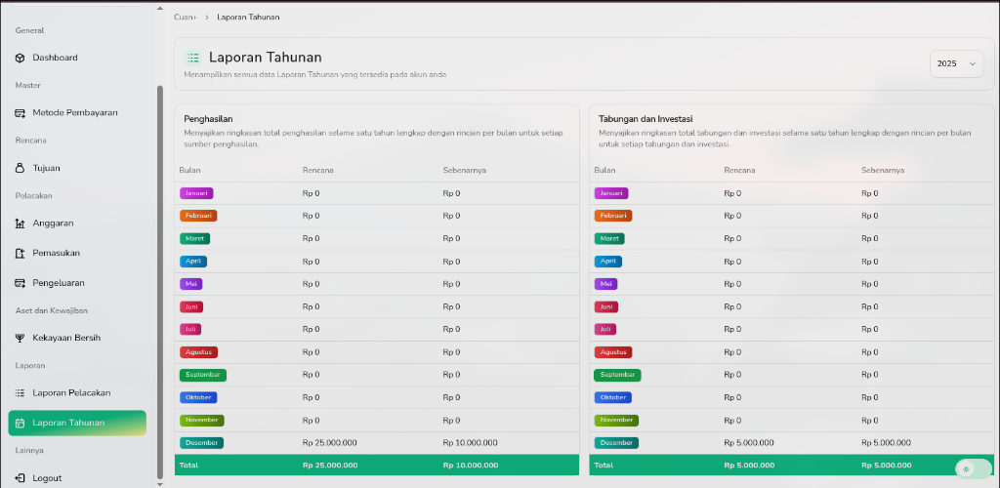

# Cuan+

**Cuan+** is a modern, elegant personal finance planner designed to help you track your income, expenses, and financial goals with ease. Built with a focus on user experience and visual appeal, it helps you manage your wealth effectively.



## Features

- **Dashboard**: A comprehensive overview of your financial health, including Income, Expenses, and Savings summaries.
- **Budgeting**: Create and manage monthly budgets to stay on track.
- **Goal Tracking**: Set financial goals (like "Holiday to Japan") and track your progress visually.
- **Transaction Tracking**: Record every income and expense with detailed categories.
- **Interactive Charts**: Visualize your cash flow with beautiful, animated charts.
- **Dark Mode**: A sleek, fully optimized dark theme for comfortable night-time usage.
- **Responsive Design**: Works perfectly on desktop and mobile devices.

## Gallery

### Dark Mode

Experience the elegant dark theme designed for focus and clarity.


### Budget Management

Manage your monthly allocations effortlessly.


### Reports

Detailed annual reports and breakdowns.


## Tech Stack

- **Framework**: [Laravel 12](https://laravel.com)
- **Frontend**: [React 18](https://reactjs.org) with [Inertia.js](https://inertiajs.com)
- **Styling**: [Tailwind CSS](https://tailwindcss.com) & [Shadcn UI](https://ui.shadcn.com)
- **Icons**: [Tabler Icons](https://tabler-icons.io)
- **Charts**: [Recharts](https://recharts.org)

<!-- ## 🚀 Getting Started

1.  **Clone the repository**
    ```bash
    git clone https://github.com/yourusername/cuan-planner.git
    cd cuan-planner
    ```

2.  **Install Dependencies**
    ```bash
    composer install
    npm install
    ```

3.  **Environment Setup**
    ```bash
    cp .example.env .env
    php artisan key:generate
    ```

4.  **Database Configuration**
    Update your `.env` file with your database credentials.

5.  **Run Migrations**
    ```bash
    php artisan migrate
    ```

6.  **Start the Server**
    ```bash
    php artisan serve
    npm run dev
    ``` -->

## License

This project is open-sourced software licensed under the [MIT license](https://opensource.org/licenses/MIT).
